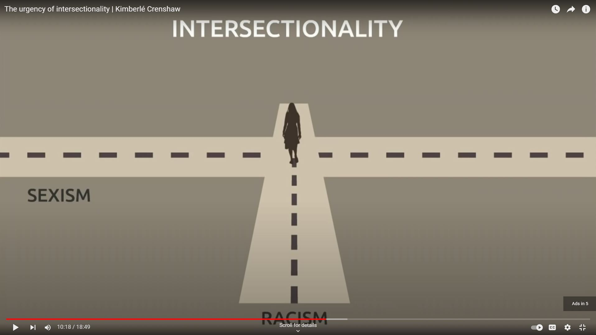
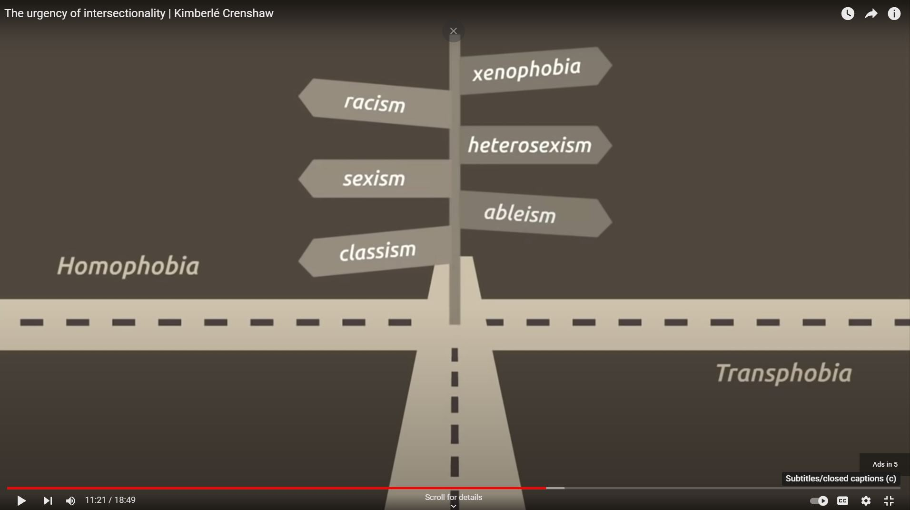
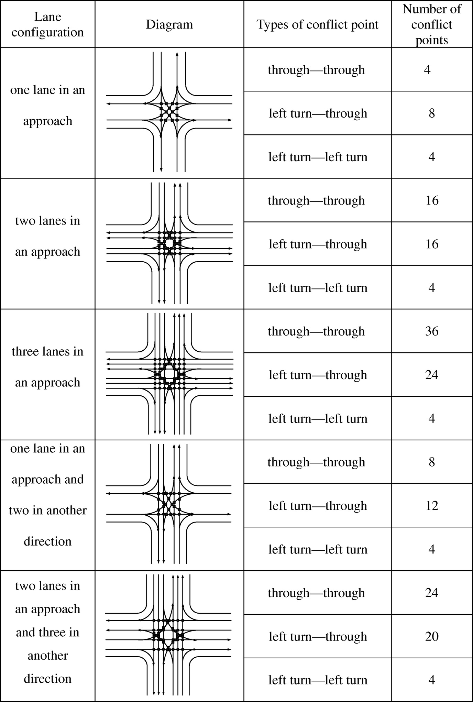
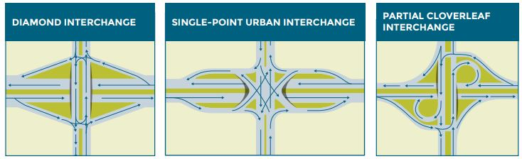
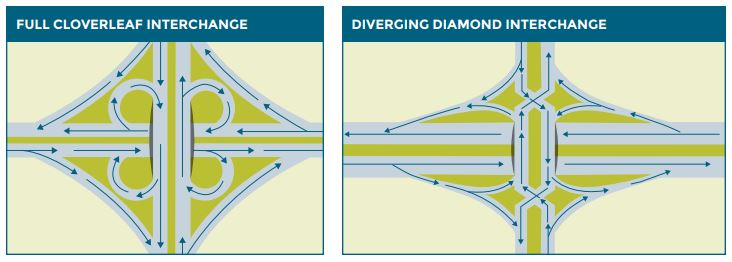

# Intersections

This folder is under construction.

Plans - include python code for different methods for intersecting data

Examples
1. Merge based on common attributes
2. Stacking/appending
3. Make mutually exclusive datasets from multiple datasets
4. Random merge based on 2 characteristics
5. Random merge of multiple characteristics
6. Nearest neighbor merge
7. Spatial join
8. Markov Chain Monte Carlo

# Discussion of Motivation

"If we can't see a problem, we can't fix a problem." [Dr. Kimberlé Crenshaw](https://www.youtube.com/watch?v=akOe5-UsQ2o){:target="_blank"}

"The intersectional experience is greater than the sum of racism and sexism, any analysis that does not take intersectionality into account cannot sufficiently address the particular manner in which Black women are subordinated." - [Dr. Kimberlé Crenshaw](https://www.youtube.com/watch?v=akOe5-UsQ2o){:target="_blank"}

Source: [Crenshaw 2017](https://www.youtube.com/watch?v=akOe5-UsQ2o){:target="_blank"}

Source: [Crenshaw 2017](https://www.youtube.com/watch?v=akOe5-UsQ2o){:target="_blank"}

The motivation for intersecting community data is to preserve the intersectionality of socioeconomic characteristics that identify race, sex, class, and ability.  

# Famous Intersections

Source: [Tenor 2018](https://tenor.com/view/arc-de-triomphe-arc-of-triumph-paris-france-gif-12234073)

# Transportation Intersection/Interchange examples
As a planner I love road intersections and interchanges.  

Source: [Shen 2013](https://doi.org/10.1061/(ASCE)TE.1943-5436.0000485)

"Sec. 541.303.  INTERSECTION.  (a)  In this subtitle, "intersection" means the common area at the junction of two highways, other than the junction of an alley and a highway." (State of Texas)

"Traditional intersections are places where vehicles, pedestrians, and bicyclists cross paths." (Federal Highway Administration)

Intersection safety: ways to reduce conflict points (FHWA n.d.)

"WHAT’S THE DIFFERENCE BETWEEN AN INTERCHANGE AND AN INTERSECTION?
An interchange uses grade separation, meaning roads are at different heights, with
ramps connecting the roadways so as not to disrupt the flow of traffic flow. An intersection
is when roads cross at-grade, at the same height." (Nebraska DOT, n.d.)

"An interchange is a roadway junction that uses grade separation, with one or more ramps, to allow
traffic on at least one highway to pass through the junction without impeding the flow of traffic.
The primary purpose of an interchange is to reduce conflicts caused by vehicle crossings and
minimize conflicting left-turn movements. Interchanges are typically found on interstates and multilane highways, or 
sometimes high-volume roads, where traffic cannot be efficiently controlled by
intersections at-grade." (Nebraska DOT, n.d.)

Source: [NBDOT nd](https://dot.nebraska.gov/media/114536/ndot_piassist_factsheets_interchanges.pdf)

# Intersection to interchange
- How do we reduce conflicts at intersections? 
- Would interchange be better than intersection?

# References
Crenshaw, K. (2017). The urgency of intersectionality | Kimberlé Crenshaw | TEDxStanford. Retrieved from https://www.youtube.com/watch?v=akOe5-UsQ2o

Crenshaw, K. (2018). Demarginalizing the intersection of race and sex: A Black feminist critique of antidiscrimination doctrine, feminist theory, and antiracist politics [1989]. In Feminist legal theory (pp. 57-80). Routledge. https://philpapers.org/archive/CREDTI.pdf?ncid=txtlnkusaolp00000603 

Crenshaw, K. University of Chicago Legal Forum; 1989. Demarginalizing the intersection of race and sex: A black feminist critique of antidiscrimination doctrine, feminist theory and antiracist politics, 139.

FHWA (n.d.). About Intersection Saftey. Retrieved from https://safety.fhwa.dot.gov/intersection/about/

Nebraska Department of Transportation (n.d.). Interchanges. Retrieved from: https://dot.nebraska.gov/media/114536/ndot_piassist_factsheets_interchanges.pdf

Shen, J., Tian, Z., & Wang, W. (2013). Correlation between degree of complexity and efficiency for intersections in China. Journal of transportation engineering, 139(2), 193-199. https://doi.org/10.1061/(ASCE)TE.1943-5436.0000485

State of Texas (n.d.) Texas Transportation Code. Retrieved from: https://statutes.capitol.texas.gov/Docs/TN/htm/TN.541.htm#:~:text=INTERSECTION.,an%20alley%20and%20a%20highway.
